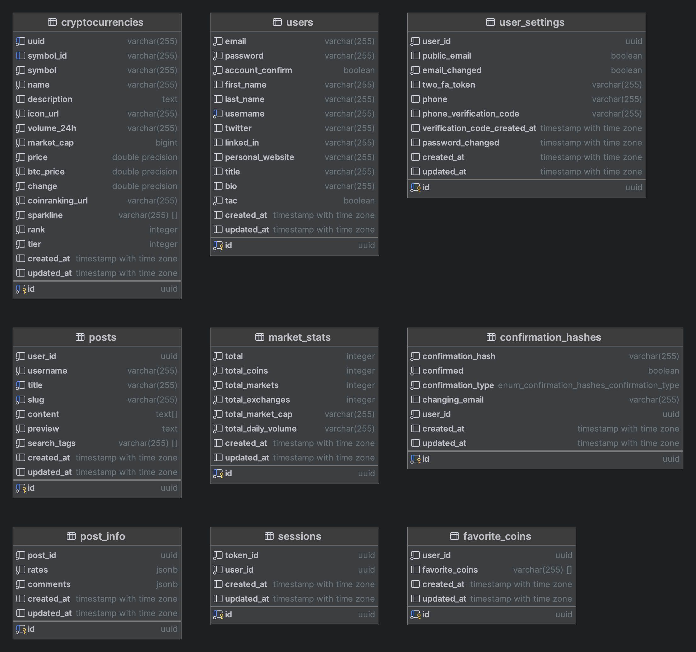

<h1 align="center">
   Cryptotalks
</h1>

# Table of contents
1. [Introduction](#introduction)
2. [Microservices infrastructure](#microservices-infrastructure)
   1. [Description of the microservices infrastructure](#description-of-the-microservices-infrastructure)
   2. [Types of communication](#types-of-communication)
   3. [Details of infrastructure implementation in the project](#details-of-infrastructure-implementation-in-the-project)
3. [Available endpoints](#available-endpoints)
   1. [Users module](#users-module)
   2. [Post module](#post-module)
   3. [Authentication module](#authentication-module)
   4. [Cryptocurrency module](#cryptocurrency-module)
4. [Microservices and their roles](#microservices-and-their-roles)
   1. [Front end](#front-end)
   2. [Back-end (API Gateway) and its key elements](#back-end-api-gateway-and-its-key-elements)
   3. [Authentication](#authentication)
   4. [Users](#users)
   5. [Posts](#posts)
   6. [Crypto rates](#crypto-rates)
   7. [Common](#common)
5. [Internal documentation](#internal-documentation)
6. [Technical requirements to run the project](#technical-requirements-to-run-the-project)
7. [Literature and other sources](#literature-and-other-sources)
8. [License](#license)

## Introduction

Cryptocurrencies have become a hot topic in recent years, with more and more people showing interest in this digital form of currency. From Bitcoin to Ethereum, these decentralized currencies have revolutionized the way we view and use money. With the growth of cryptocurrencies, it has become crucial to provide a platform where people can meet and discuss the latest news, trends and developments in the world of digital currencies.

This is where Cryptotalks comes in - the forum/blog platform is designed to gather cryptocurrency enthusiasts who share their knowledge, experiences and opinions on everything related to cryptocurrencies.

This project was developed using a microservices framework, which makes it flexible and also makes it easier for developers to develop the application as it evolves over time. Before we begin to describe the architecture itself, as well as how it is implemented, below is a short list of technologies that were used during the development of the project.

- **Programming languages**: JavaScript, TypeScript
- **Frameworks**:
  - **Front-end**: Next.js (React.js + TypeScript + Server-Side Rendering)
  - **Back-end and microservices**: Nest.js
- **Databases and ORMs**: PostgreSQL, MongoDB, Sequelize
- **Microservice platforms**: Docker, Apache Kafka
- **Other technologies**:
   - **Describing documentation**: Swagger, OpenAPI – Version control system: Git
   - **Package manager**: NPM
   - **Static file storage**: AWS S3
- **External APIs and service providers**:
  - **Email sending service**: SendGrid
  - **SMS messaging service**: Twilio
  - **Downloading data on cryptocurrencies**: RapidApi, CoinGecko (Getting general information), Coinranking (Getting market information)

## Microservices infrastructure

Below we will describe what a microservices infrastructure is, what it consists of, and what it is there are types of communication as well as details and tools for implementing this infrastructure in the project.

### Description of the microservices infrastructure

As already mentioned above, this application was built according to the microservice approach. The next section will specifically describe the functionality of each microservice, but before that, it's worth discussing whether there are microservices.

**Microservice architecture** - is an approach to building applications as a collection of small, independently deployed services, each running in its own process and communicating through lightweight mechanisms such as HTTP APIs or message queues.

A microservices architecture typically consists of the following components:

1. **Services**: Microservices (or microservices) are individual services that make up an application. Each microservice is a standalone module that performs a specific business function, such as user authentication or order processing.
2. **API Gateway**: The API Gateway is the entry point for all external requests to the application. It receives requests from clients and routes them to the appropriate microservices.
   It also performs other functions such as authentication and rate limiting.
3. **Service Registry**: The Service Registry is a central directory where information about all microservices in the system is stored, including their location and endpoints. This allows the API Gateway to route requests to the correct microservice.
4. **Load Balancer**: A load balancer distributes requests across multiple microservice instances to ensure the system can handle heavy traffic and ensure high availability.
5. **Database**: Each microservice usually has its own database where it stores its data. Databases can be of different types and can be located in different physical locations.
6. **Monitoring and logging**: Monitoring and logging are key elements of microservices architecture. They allow developers to track system performance, identify issues, and troubleshoot.
7. **Deployment and orchestration**: Microservices are typically deployed using containerization technologies such as Docker and managed with orchestration platforms such as Kubernetes. This allows developers to easily deploy, scale, and manage microservices.

In general, microservices architecture is designed to enable teams to build applications that are
scalable, resilient, and maintainable. It provides a flexible and modular approach to application development that allows developers to focus on building small, focused services that can be quickly deployed and updated independently of each other.

The main advantage of the microservices architecture approach is that the failure of one service will not have a negative impact on the availability of other services and the operation of the entire project. For example, in this project, an error in the operation of the cryptocurrency exchange service will not affect the project in its entirety, it will still be possible to log in to the account and write posts, because these functionalities are implemented as separate microservices.

### Types of communication

In a microservices architecture, there are several ways for different services to communicate. Here are some of the most common types of communication between microservices:

- **Synchronous communication (API Calls)**: This is a type of communication where the service that initiates the communication blocks the communication until it receives a response from the other service. The most common example of synchronous communication is the Request-Reply pattern, where a client service sends a request to a server service and the server sends back a response. This type of communication is useful when an immediate response is required and the client cannot proceed without it.
- **Asynchronous communication (via Message Broker)**: This is a type of communication where the service that initiates the communication does not wait for a response from the other service. Instead, it sends the message to a message broker or queue, and the other service consumes the message when it's ready. Asynchronous communication is useful when a response is not required immediately and the client can run without it.

For this particular project, a mixed approach of both types of communication was used. This means that from the front end, the user sends requests to the API entry gateway. This API has several roles which will be described below. But the point is that if it is a synchronous operation, e.g. logging in, the API will process this query and return a response, because from the architecture and UI/UX level, there is no point in adding such an operation to the queue if it is an asynchronous operation e.g. creating a record in the database with the new user's settings, such an operation can be added to the queue and the response returned to the user faster, which will ensure good UI/UX.

And to solve such a problem, or at least show how it can be done, communication between of individual microservices was implemented using **Apache Kafka**.

**Apache Kafka** - is a distributed streaming platform designed to handle large amounts of data in real time. It was originally developed by LinkedIn and later made open source for the Apache Software Foundation. Kafka is scalable and fault tolerant, making it ideal for building real-time data pipelines and streaming applications. Kafka is very well suited for:

- **Real-time processing**: Kafka allows you to process data as it flows in real time, making it ideal for applications such as fraud detection, monitoring and alerting.
- **Messaging**: Kafka can be used as a messaging system to transfer data between different systems or applications.

### Details of infrastructure implementation in the project

At this point, it would be worth discussing how the individual components were implemented, and what is the difference between large, production environments and this project, which was implemented for educational purposes, to show how microservices work on an example. Generally, some components were not created either by the scale of the project, because it is too small and implementing it does not make sense (or by implementing it on a smaller scale), or by the fact that this project as such does not have a production environment, i.e., some things are not It could be done.

1. **Service Registry**: A component of the microservices architecture that enables services to discover and communicate with each other in a dynamic and distributed environment. It provides a central directory of all available services, their locations, and other relevant metadata, facilitating seamless interaction between services. In this case, it was not implemented as a separate component, this role is played by API Gateway/Back-end.
2. **Load Balancer**: In general, the application was not written for production environment, and in development mode there is no need to control traffic flow.
   In life, traffic management is the responsibility of either a separate server that is the entry point. In such a scenario, the entire infrastructure is behind this server.
   Or the machine that hosts this application acts as a balancer.
3. **Monitoring and logging**: Most often, a monitoring system is required to monitor and report that everything is working properly in the production. In development mode, this function makes less sense, because developers have access to the source code of individual components, which facilitates the debugging and bug-finding process.
   However, the login process was implemented using MongoDB. When some important action happens, any microservice can create and send a record to this remote database (collection) with information about this event. It can be like some kind of error, as well as an action such as creating an account by the user.
4. **Deployment and orchestration**: Docker and Apache Kafka were used as orchestration for this project. All services have been compiled in docker-compose.yml and can be run together on the same network. In addition, scripts have been saved in the root folder of the project in the package.json file, which allow you to perform services both together and separately in containers.
5. **Database**: As it was indicated above, in the case of large projects, when each micro-service has
   a separate database, not only logical but also physically, the main goal of the entire infrastructure is data synchronization. Due to the fact that with a database of such scale, its division does not make sense, everything was done not only in one database, but also in one schema of this database, but anyway, this synchronization process was implemented/simulated.
   It can be noticed that in the folder with database models, connections between models have not been specially made, foreign keys have not been added. This was done to simulate a real example of microservices architecture and to have each service responsible for synchronizing the entire database.
   So, despite the fact that it is logically and physically one database, the lack of foreign keys simulates the operation as if we physically had several databases.
   You can also pay attention to the fact that some fields store JSON as a data type (no. rates and comments), which formally violates the form of the database, but firstly, the type of these data was described in the code, and secondly, it was done specifically to save resources.

|  | 
|:---------------------------:| 
|           *Space*           |

## Available endpoints

### Users module

### Post module

### Authentication module

### Cryptocurrency module

## Microservices and their roles

### Front end

### Back-end (API Gateway) and its key elements

### Authentication

### Users

### Posts

### Crypto rates

### Common

## Internal documentation

## Technical requirements to run the project

## Conclusions

## Literature and other sources

## License

Licensed by [MIT license](LICENSE).

