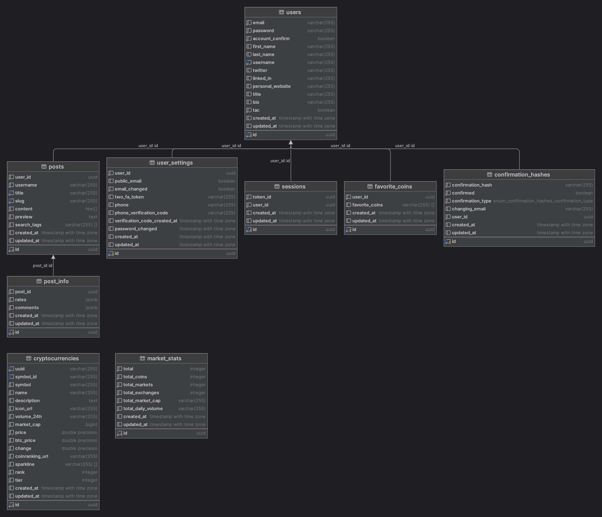
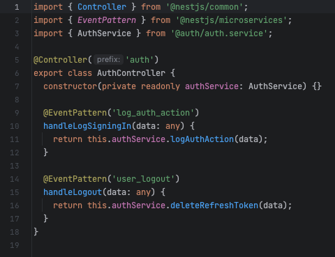
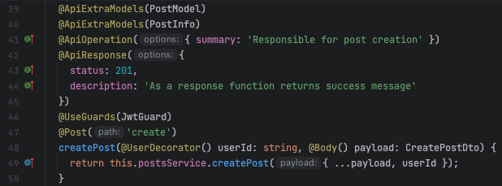
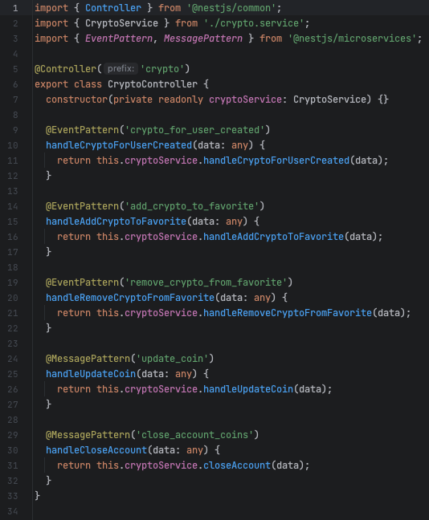

<h1 align="center">
   Cryptotalks
</h1>

# Table of contents
1. [Introduction](#introduction)
2. [Microservices infrastructure](#microservices-infrastructure)
   1. [Description of the microservices infrastructure](#description-of-the-microservices-infrastructure)
   2. [Types of communication](#types-of-communication)
   3. [Details of infrastructure implementation in the project](#details-of-infrastructure-implementation-in-the-project)
3. [Available endpoints](#available-endpoints)
   1. [Users module](#users-module)
   2. [Post module](#post-module)
   3. [Authentication module](#authentication-module)
   4. [Cryptocurrency module](#cryptocurrency-module)
4. [Microservices and their roles](#microservices-and-their-roles)
   1. [Front end](#front-end)
   2. [Back-end (API Gateway) and its key elements](#back-end-api-gateway-and-its-key-elements)
   3. [Authentication](#authentication)
   4. [Users](#users)
   5. [Posts](#posts)
   6. [Crypto rates](#crypto-rates)
   7. [Common](#common)
5. [Internal documentation](#internal-documentation)
6. [Technical requirements to run the project](#technical-requirements-to-run-the-project)
7. [Literature and other sources](#literature-and-other-sources)
8. [License](#license)

## Introduction


Cryptocurrencies have become a hot topic in recent years, with more and more people showing interest in this digital form of currency. From Bitcoin to Ethereum, these decentralized currencies have revolutionized the way we view and use money. With the growth of cryptocurrencies, it has become crucial to provide a platform where people can meet and discuss the latest news, trends and developments in the world of digital currencies.

This is where Cryptotalks comes in - the forum/blog platform is designed to gather cryptocurrency enthusiasts who share their knowledge, experiences and opinions on everything related to cryptocurrencies.

This project was developed using a microservices framework, which makes it flexible and also makes it easier for developers to develop the application as it evolves over time. Before we begin to describe the architecture itself, as well as how it is implemented, below is a short list of technologies that were used during the development of the project.

- **Programming languages**: JavaScript, TypeScript
- **Frameworks**:
  - **Front-end**: Next.js (React.js + TypeScript + Server-Side Rendering)
  - **Back-end and microservices**: Nest.js
- **Databases and ORMs**: PostgreSQL, MongoDB, Sequelize
- **Microservice platforms**: Docker, Apache Kafka
- **Other technologies**:
   - **Describing documentation**: Swagger, OpenAPI – Version control system: Git
   - **Package manager**: NPM
   - **Static file storage**: AWS S3
- **External APIs and service providers**:
  - **Email sending service**: SendGrid
  - **SMS messaging service**: Twilio
  - **Downloading data on cryptocurrencies**: RapidApi, CoinGecko (Getting general information), Coinranking (Getting market information)

## Microservices infrastructure


Below we will describe what a microservices infrastructure is, what it consists of, and what it is there are types of communication as well as details and tools for implementing this infrastructure in the project.

### Description of the microservices infrastructure

As already mentioned above, this application was built according to the microservice approach. The next section will specifically describe the functionality of each microservice, but before that, it's worth discussing whether there are microservices.

**Microservice architecture** - is an approach to building applications as a collection of small, independently deployed services, each running in its own process and communicating through lightweight mechanisms such as HTTP APIs or message queues.

A microservices architecture typically consists of the following components:

1. **Services**: Microservices (or microservices) are individual services that make up an application. Each microservice is a standalone module that performs a specific business function, such as user authentication or order processing.
2. **API Gateway**: The API Gateway is the entry point for all external requests to the application. It receives requests from clients and routes them to the appropriate microservices.
   It also performs other functions such as authentication and rate limiting.
3. **Service Registry**: The Service Registry is a central directory where information about all microservices in the system is stored, including their location and endpoints. This allows the API Gateway to route requests to the correct microservice.
4. **Load Balancer**: A load balancer distributes requests across multiple microservice instances to ensure the system can handle heavy traffic and ensure high availability.
5. **Database**: Each microservice usually has its own database where it stores its data. Databases can be of different types and can be located in different physical locations.
6. **Monitoring and logging**: Monitoring and logging are key elements of microservices architecture. They allow developers to track system performance, identify issues, and troubleshoot.
7. **Deployment and orchestration**: Microservices are typically deployed using containerization technologies such as Docker and managed with orchestration platforms such as Kubernetes. This allows developers to easily deploy, scale, and manage microservices.


In general, microservices architecture is designed to enable teams to build applications that are
scalable, resilient, and maintainable. It provides a flexible and modular approach to application development that allows developers to focus on building small, focused services that can be quickly deployed and updated independently of each other.

The main advantage of the microservices architecture approach is that the failure of one service will not have a negative impact on the availability of other services and the operation of the entire project. For example, in this project, an error in the operation of the cryptocurrency exchange service will not affect the project in its entirety, it will still be possible to log in to the account and write posts, because these functionalities are implemented as separate microservices.

### Types of communication

In a microservices architecture, there are several ways for different services to communicate. Here are some of the most common types of communication between microservices:

- **Synchronous communication (API Calls)**: This is a type of communication where the service that initiates the communication blocks the communication until it receives a response from the other service. The most common example of synchronous communication is the Request-Reply pattern, where a client service sends a request to a server service and the server sends back a response. This type of communication is useful when an immediate response is required and the client cannot proceed without it.
- **Asynchronous communication (via Message Broker)**: This is a type of communication where the service that initiates the communication does not wait for a response from the other service. Instead, it sends the message to a message broker or queue, and the other service consumes the message when it's ready. Asynchronous communication is useful when a response is not required immediately and the client can run without it.

For this particular project, a mixed approach of both types of communication was used. This means that from the front end, the user sends requests to the API entry gateway. This API has several roles which will be described below. But the point is that if it is a synchronous operation, e.g. logging in, the API will process this query and return a response, because from the architecture and UI/UX level, there is no point in adding such an operation to the queue if it is an asynchronous operation e.g. creating a record in the database with the new user's settings, such an operation can be added to the queue and the response returned to the user faster, which will ensure good UI/UX.


And to solve such a problem, or at least show how it can be done, communication between of individual microservices was implemented using **Apache Kafka**.

**Apache Kafka** - is a distributed streaming platform designed to handle large amounts of data in real time. It was originally developed by LinkedIn and later made open source for the Apache Software Foundation. Kafka is scalable and fault tolerant, making it ideal for building real-time data pipelines and streaming applications. Kafka is very well suited for:

- **Real-time processing**: Kafka allows you to process data as it flows in real time, making it ideal for applications such as fraud detection, monitoring and alerting.
- **Messaging**: Kafka can be used as a messaging system to transfer data between different systems or applications.

### Details of infrastructure implementation in the project

At this point, it would be worth discussing how the individual components were implemented, and what is the difference between large, production environments and this project, which was implemented for educational purposes, to show how microservices work on an example. Generally, some components were not created either by the scale of the project, because it is too small and implementing it does not make sense (or by implementing it on a smaller scale), or by the fact that this project as such does not have a production environment, i.e., some things are not It could be done.

1. **Service Registry**: A component of the microservices architecture that enables services to discover and communicate with each other in a dynamic and distributed environment. It provides a central directory of all available services, their locations, and other relevant metadata, facilitating seamless interaction between services. In this case, it was not implemented as a separate component, this role is played by API Gateway/Back-end.
2. **Load Balancer**: In general, the application was not written for production environment, and in development mode there is no need to control traffic flow.
   In life, traffic management is the responsibility of either a separate server that is the entry point. In such a scenario, the entire infrastructure is behind this server.
   Or the machine that hosts this application acts as a balancer.
3. **Monitoring and logging**: Most often, a monitoring system is required to monitor and report that everything is working properly in the production. In development mode, this function makes less sense, because developers have access to the source code of individual components, which facilitates the debugging and bug-finding process.
   However, the login process was implemented using MongoDB. When some important action happens, any microservice can create and send a record to this remote database (collection) with information about this event. It can be like some kind of error, as well as an action such as creating an account by the user.
4. **Deployment and orchestration**: Docker and Apache Kafka were used as orchestration for this project. All services have been compiled in docker-compose.yml and can be run together on the same network. In addition, scripts have been saved in the root folder of the project in the package.json file, which allow you to perform services both together and separately in containers.
5. **Database**: As it was indicated above, in the case of large projects, when each micro-service has
   a separate database, not only logical but also physically, the main goal of the entire infrastructure is data synchronization. Due to the fact that with a database of such scale, its division does not make sense, everything was done not only in one database, but also in one schema of this database, but anyway, this synchronization process was implemented/simulated.
   It can be noticed that in the folder with database models, connections between models have not been specially made, foreign keys have not been added. This was done to simulate a real example of microservices architecture and to have each service responsible for synchronizing the entire database.
   So, despite the fact that it is logically and physically one database, the lack of foreign keys simulates the operation as if we physically had several databases.
   You can also pay attention to the fact that some fields store JSON as a data type (no. rates and comments), which formally violates the form of the database, but firstly, the type of these data was described in the code, and secondly, it was done specifically to save resources.

|  | 
|:---------------------------------------------:| 
|               *Cryptotalks UML*               |

Otherwise, if the implementation of the project did not rely on microservices, all tables in the database could be joined with foreign keys, in which case it would be a safeguard against accidental deletion of related records.

|  |
|:-----------------------------------------------------------------:|
|                    *Cryptotalks UML with keys*                    |

## Available endpoints

The whole architecture of the project will be described later in the section with microservices and their roles. At the moment, it is worth knowing that the input gateway/API Gateway/Back-end is the only place in the entire project that operates on the REST principle, accepting and returning requests using the HTTP protocol.

The modules that the back-end consists of will be described below. Each module properly communicates with microservices. Documentation can also be found in the form of Swagger OpenAPI - more about it in the internal documentation section.

### Users module


1. **POST sign-up** - This endpoint is responsible for user registration in the system. In addition, it is responsible for adding events to the queue along with sending an email to confirm registration and creating a record with the user's favorite cryptocurrencies.
2. **POST sign-in** - As the name suggests, this endpoint is responsible for user authentication. Returns 2 tokens as response - access token and refresh token. (Two-factor authentication may be required.)
3. **GET account-confirmation/:confirmationHash** - After registration, the user must verify their account by clicking on the link in the email. Once passed, this endpoint is responsible for verifying and confirming the account. Without this, the user will not even be able to log into their account.
4. **GET email-change-confirmation/:confirmationHash** - Like the previous endpoint, the user's email change confirmation endpoint has the same logic. This procedure is only available once.
5. **GET logout** - Due to the presence of 2 user authentication tokens and saving data about one of them in the database, after the user logs out of his account, the information should be deleted. This endpoint has been implemented for this purpose.
6. **POST change-email** - This endpoint initiates the change-email procedure. The user will then have to confirm this by clicking on the link in the email. Verification will be processed by the endpoint described above.
   (Two-factor authentication may be required.)
7. **POST change-password** - Allows the user to change the password. Available once every 24 hours. (Two-factor authentication may be required.)
8. **POST forgot-password** - This option is available on the account login page and allows the user to regain access to the account by clicking on the link in the email.
9. **POST close-account** - Deletes the user account with all information including posts and cryptocurrencies. (Two-factor authentication may be required.)
10. **POST set-2fa** - Configures multi-factor authentication via mobile app (Google Authenticator)
11. **POST remove-2fa** – Removes multi-factor authentication via the mobile app.
12. **POST set-phone** - Alternative way of multi-factor authentication after by sending an SMS to a telephone number.
13. **POST remove-phone** - Removes the phone from the account.
14. **GET get-settings** - When the user logs into his account in the settings section, this endpoint will be responsible for downloading them.
15. **POST upload-photo** - Each user can change their default profile picture and upload their own photo. This endpoint is responsible for it. It converts the photo to a Base64 string and uploads it via AWS-SDK to the cloud.

|                                                                                                                                                                                                                                                                                                                                                                                                                                                      |
|:---------------------------------------------------------------------------------------------------------------------------------------------------------------------------------------------------------------------------------------------------------------------------------------------------------------------------------------------------------------------------------------------------------------------------------------------------------------------------------------------------------------:|
| *So in Amazon cloud services it looks like a bucket where all static project files are stored. You can notice that it is publicly available, which is usually not the best solution, but in this case, since only public data is stored there, it is acceptable. Also, when users upload their photos, firstly, they can only upload 1 photo because their ID is used for recording, which will overwrite the file on subsequent uploads, and secondly, only the API has the keys to save files in the bucket.* |

|  |
|:---------------------------------------------------------:|
|            *Uploading files to AWS S3 Bucket*             |


16. **GET get/:username** - The last endpoint in this service allows you to read public information about users on public pages. It is worth to mention that username is a unique field.

### Post module

1. **POST create** – As the name suggests, this endpoint is responsible for creating a post.
2. **GET get/:slug?toEdit=** - In the context of web development and content management systems (CMS), a slug is a user-friendly URL or part of a URL that identifies a specific
   page or resource on a site. A slug usually consists of a few words describing the content of the page, separated by hyphens, and is intended to make the URL more readable and memorable for people.
   The default post URL might be https://example.com/post?id=123, which isn't very meaningful or easy to remember. Using a slug, the URL can be turned into something like https://example.com/10-tips-for-better-sleep, which is much more descriptive and easier to remember.
   Slag generation is usually handled automatically by CMS platforms or web frameworks that take the content title and convert it into a proper slug. However, users may also be able to customize the slug to their liking.
   It's also worth mentioning that there is a toEdit query parameter for this endpoint that allows you to get the post in edit mode.
3. **GET list/:page/:pageSize/:order/:orderBy?searchQuery=&username=&tags=** - This endpoint allows you to get a list of posts using pagination. There are also parameters that I can specify in the query, such as tags, author name, and post title.
4. **DELETE delete/:id?code=&twoFaCode=** – Delete a post. (Two-factor authentication may be required.)
5. **PATCH update/:id** - Post update.
6. **PATCH comment/:id** – Adding a comment to a post.
7. **PATCH rate/post/:id** - Rate the post.
8. **PATCH rate/comment/:postId/:commentId** – Rating of the comment to the post. 

### Authentication module

1. **GET refresh** - The method of user authentication consists in the use of 2 tokens, the methodology of which will be described below. This endpoint is responsible for their regeneration.

### Cryptocurrency module

1. **GET list/:page/:pageSize/:order/:orderBy?searchQuery=** - Allows you to get a list of cryptocurrencies using pagination and also use the search parameter to find the desired cryptocurrency.
2. **GET get/:uuid** - Due to the fact that the API (Coinranking), which is used to download and update cryptocurrencies using webjobs, has its own ID, this exact ID is used to download data about the cryptocurrency.
3. **GET market-stats** - Along with data on cryptocurrencies, the API also provides data on the global market. This endpoint is responsible for receiving this data.
4. **PATCH favorites/:id** - Adds the cryptocurrency to the list of favorite cryptocurrencies used clerk
5. **DELETE favorites/:id** - Deletes the cryptocurrency to the list of favorite cryptocurrencies used clerk
6. **GET list-favorites/:page/:pageSize/:order/:orderBy?username=** – On a user's public page, you can get a list of his favorite cryptocurrencies using this endpoint.

## Microservices and their roles

The project consists of 4 microservices - **Authentication**, **Crypto rates**, **Posts** and **Users**. Additionally, we have **front-end** and **back-end (API Gateway)**.

|  |
|:-------------------------------------------------:|
|                *Project structure*                |

From the architectural level, it looks like that the end user, using the interface, sends all queries to the back-end, which in this case is the API entrance gate. Later, depending on the type of query, the back-end adds this query to the Apache Kafka queue from which the target service pulls and processes this query, returning a response.

### Front end

The front-end of the project was written using the **Next.js** framework, which is basically React + Typescript + SSR. In this particular case, since there is no production mode, there was no need to do SEO optimization and server-side rendering, which is the main feature of Next.js. This means that in principle React + TypeScript could have been used, but Next.js was chosen because of other features like routing, API building approach, etc.

### Back-end (API Gateway) and its key elements

The service named in the project's API is the gateway - **API Gateway**. It receives requests from the client and then routes them to the appropriate services by adding these requests to the queue. In this case, it is not a microservice due to the fact that it is the only service in the entire project with which communication is based on the REST principle. 

It is worth adding here that this part plays several roles in a given project. **The back-end is responsible not only for adding the event to the Apache Kafka queue, but also for processing the business logic**. Only those events that can be asynchronous are added to the queues. Below, for each microservice, all events along with their functionality will be described. The key elements of the backend are:

- **Modules** - the entire API has been divided into 4 main modules. Each of the modules responsible for the business logic as well as for the operation of each microservice.
For example, when a user is registered in the system, the API creates and checks this user (e.g. whether a user with such an e-mail address already exists in the system).
If everything was fine and the user was created, the API adds events to the queue that will be processed by the microservice. In this case, an event is added to the Auth microservice queue that will create a settings instance for that user and send an account confirmation email.
**It is very important to remember that microservices do not contain business logic for data validation, this is handled by the API Gateway, and they are only there to synchronize databases.**
- **Security** - The API is the only entry point for the entire application. Due to how microservices work, namely to a website that is a microservice (in this case), it is impossible to send an HTTP query and a query to a microservice at the same time, the API acts as an API Gateway, Back-end and the Register of Services.
- **Exceptions** - due to the fact that the project is built on the microservices architecture, one protocol is used for communication between the frontend and the backend is HTTP, and a different protocol is used for communication between the backend and microservices – Kafka protocol, exceptions for these protocols are processed in different ways.
_Here it is worth telling how Apache Kafka works. Being a message broker, as such Kafka does not return an HTTP response. This means that an error in the microservice cannot be processed in such a way that the API returns an HTTP exception. To be honest, you can do that, and you can make the API wait for a response from the microservices and process an error if necessary, but then that would be normal synchronous code and the microservices architecture wouldn't make any sense. It's worth saying here that even though Kafka uses the Kafka pro tocol protocol, which is not an RPC protocol because it doesn't expose methods or functions that can be called remotely, errors in the code would be handled this way._

One thing is clear from this, all errors are processed on the back-end, not in microservices, because otherwise it is impossible to return errors to the front-end. And from this comes another very important thing, all the business logic to validate data is on the back-end, not in microservices. **Microservices are only needed for synchronization**.

### Authentication

|  |
|:----------------------------------------------:|
|           *Auth microservice events*           |


As the name of this microservice, as well as the events contained in it, suggest, the authentication microservice is responsible for everything related to user tokens.

At this stage, it is worth discussing how the login system works in this project. After registration and entering the correct e-mail address and password, the user receives 2 tokens - an access token and a refresh token. The first of the pair - the access token - is responsible for checking whether the user has access to  this function. For example, only a registered and logged in user can post. This was done using the so-called guards on the back-end. This decorator contains a function that retrieves the user's token from the headers and checks that this token is OK (not expired and generated with the correct secret key).

|                                                                                                                                                                                                                 |
|:------------------------------------------------------------------------------------------------------------------------------------------------------------------------------------------------------------------------------------------------:|
| *Example of an endpoint on the back-end, the functionality of which is available only to logged in users. The @UseGuards(JwtGuard) decorator checks if a user is logged in, and UserDecorator() retrieves that user's ID if they are logged in.* |

|                                                                                                                                                                                                                                                            |
|:----------------------------------------------------------------------------------------------------------------------------------------------------------------------------------------------------------------------------------------------------------------------------------------------------------------:|
| *This is the business logic implementation of the function that checks it. As you can see, this function takes a value called x-access-token from the header and checks it. In case everything is ok, it will append the user id to the query, which will later be retrieved by the @UserDecorator() decorator.* |

The second token from this pair - refresh token - is an auxiliary token and is used so that the user does not have to log in every time. It works in such a way that the access token has a fairly short lifetime - 15 minutes, while the refresh token has a longer lifetime - 7 days. These settings, along with the JWT key, can be changed via environment variables.

|  |
|:---------------------------------------:|
|    *JWT (JSON Web Token) settings.*     |


This refresh token refreshes both tokens each time a logged-in user visits their account page (the refresh token endpoint additionally returns some user data, this is needed on some pages, not only on the account page). This is for so that if someone else gets access to this token, they don't have too much time to do something with their user account. It is also worth adding here that the refresh token is saved to the cookie with the httpOnly flag. This means that it is not possible to access this token via JavaScript in the browser to refresh both tokens later.

This mechanism has 2 main purposes - it ensures the security of the user's account - thanks to 2 tokens, one of which is not accessible via JavaScript, it will be much harder to hack the user's account - and it also creates a good UI / UX - the user does not have to log in every time to his account because his token expires quickly. The user will be logged out only if the refresh token expires, i.e. in 7 days without activity.


Coming back to the microservice, we have 2 events:
1. _log_auth_action_ – almost every microservice has a similar action that is used to save and send action logs to a remote MongoDB log database. Login and registration actions are saved in this microservice. For example, if a user tries to create an account with an existing email.
2. _user_logout_ – it is also worth adding that tokens are saved to the database to track how many active sessions a given user has from this account. Using this mechanism, we can manipulate it (or give the user the ability to manipulate it), e.g. by changing the number of sessions that are available at the same time, or terminating them. In this case, this function simply deletes this token's data (refresh token) from the database.
   
What does microservices architecture have to do with it? It works in such a way that on the API side (back-end) we check if the user is logged in and if he has a valid and correct token. If so, an event will be added to the queue, which will later be downloaded and processed by this microservice - namely, removing the token from the database.
In the meantime, as long as the action is processed asynchronously by the microservice, the user immediately receives a response.

### Users

|         |
|:------------------------------------------------------:|
|              *Users microservice events.*              |

This microservice is responsible for all activities related to the creation, deletion and modification of users, as well as data about them.


A microservice with users has the following events:
1. _log_user_action_ – As already described above, each microservice has an event that allows you to document specific data in the form of logs, including errors.
2. _user_created_ - As the name suggests, this event is responsible for creating a user by entering registration data into the database, as well as sending an e-mail confirming the registration of the account.
3. _confirm_user_account_ - After clicking on the link in the e-mail, the user confirms the registration and this event modifies his record in the database, as well as confirms the used hash (since confirmation hashes can be used for different purposes).

|  |
|:----------------------------------------------------------------------------------------------------------------:|
|                *Types of confirmation hashes (EMAIL_CHANGE, REGISTRATION and FORGOT_PASSWORD). .*                |

4. _change_email_ - Initiates the process of changing the user's email address (but does not change it!) by sending an email to the new email address. Immediately after confirmation the email will be changed using another event (update_user_security_settings).
5. _update_user_account_ - This event is responsible for everything related to changing information public information about the user.
6. _update_user_security_settings_ - With this event, the user can modify his security settings (change password, mail, two-factor authentication, etc.)
7. _close_user_account_ - Removes basic user information, such as name and surname e.t.c.
8. _send_verification_mobile_code_ - If the user has configured two-factor authentication via SMS to the phone, this event will be responsible for sending the code to the phone.
9. _send_verification_email_ - The function that has been implemented for this event is used not only by other events (e.g. to initiate an e-mail change), but also "from the outside", e.g. when the user forgot the password and wants to reset it.

### Posts

|  |
|:------------------------------------------------:|
|           *Posts microservice events.*           |

All activities related to the modification of entries are the responsibility of the microservice with entries. Immediately notice the first event in this microservice. As described above, MongoDB is used to save the logs, and such an event exists in every microservice and is used to save these logs.

The post microservice has the following events:
1. _log_post_action_ - Responsible for logging post actions, such as creating and deleting posts.
2. _post_created_ - This event allows you to queue the creation of a post after checking all the data in the main API. In addition, other records necessary for the existence of the facility are created. For example, a post info record is created where post ratings and comments are saved.
3. _delete_post_ - Deleting a post does the opposite, deleting the post and its data along with comments and ratings.
4. _update_post_ - This event is only available for use by the author of a specific post and allows you to modify the post but not its data. This means that the user can change the post's title and tags, but not the rating and comments.
5. _leave_comment_ – The event is available to every registered and logged-in user and allows you to leave a comment under the post.
6. _update_post_info_ - This event is responsible for post ratings, comments and ratings comments.
7. _close_account_delete_posts_ - When a user deletes an account, not only his data is deleted, but also the posts created by him (along with information about ratings and comments).

### Crypto rates

|  |
|:--------------------------------------------------------:|
|           *Crypto rates microservice events.*            |

The Crypto rates microservice is responsible for all actions related to cryptocurrencies. In addition, this service operates as a so-called webjob. Generally, the point is that once in a while (every hour) this service sends a request to the cryptocurrency exchange and downloads data about cryptocurrencies (price, change, etc.) and saves it to the database.

|  |
|:----------------------------------------------------------------------------------------------:|
|             *Cron webjob that runs 1 time per hour and updates cryptocurrencies.*              |


This microservice has the following 4 events:
1. _crypto_for_user_created_ - after user registration, the API adds an event for this microservice to the queue and, lastly, by downloading this event, creates a record in the database with the user's ID and a list of favorite cryptocurrencies (the initial list is empty).
2. _add_crypto_to_favorite_ - adds the identifier of this cryptocurrency to the list of favorite cryptocurrencies by updating the record in the database for a given user.
3. _remove_crypto_from_favorite_ - works in the same way as add_crypto_to_favorite, only removes from the list.
4. _update_coin_ - as described above, 2 APIs are used to obtain data on cryptocurrencies - Coinranking (market data) and CoinGecko (general data). While the first API is used to update market data on an hourly basis, the second is used to obtain a description of the cryptocurrency if it has not already been obtained (by accessing the cryptocurrency website).
5. _close_account_coins_ - During registration, a list with his favorite cryptocurrencies is created for the user (empty by default), and when deleting the account, this list is also deleted.

### Common

In the microservices folder you can find a folder called common. This folder contains things common to each service, such as data models, exceptions, microservice events, and DTOs.

Due to how Sequelize works as an ORM, it needs to address the database via data models. Please also note that in each Dockerfile and docker-compose link file, we copy and add volumes to these folders so that each microservice has access to these files and has a local copy.

For example, this is what the Dockerfile of the Users microservice looks like. The COPY command copies everything in this container to the specified folder.

```dockerfile
FROM node:18.10.0

WORKDIR /usr/src/cryptotalks-users

RUN npm i -g nest
RUN npm i -g @nestjs/cli

COPY ../../services/users/package*.json ./

COPY ../../services/common/models/ /usr/src/cryptotalks-users/src/models
COPY ../../services/common/dto/ /usr/src/cryptotalks-users/src/dto
COPY ../../services/common/events/ /usr/src/cryptotalks-users/src/events
COPY ../../services/common/exceptions/ /usr/src/cryptotalks-users/src/exceptions
COPY ../../services/common/mongo-schemas/ /usr/src/cryptotalks-users/src/mongo-schemas

RUN npm install

COPY ../../services/users/ .

RUN npm run build
```

Also, in the docker-compose file, the volumes that are local are mapped to what is in the containers. This is done so that changing these files will affect the logic in the containers, because otherwise we would have to reset the entire container again with every change in this common folder.

```yaml
volumes:
  - ./services/users:/usr/src/cryptotalks-users
  - ./services/common/models:/usr/src/cryptotalks-users/src/models
  - ./services/common/dto:/usr/src/cryptotalks-users/src/dto
  - ./services/common/events:/usr/src/cryptotalks-users/src/events
  - ./services/common/exceptions:/usr/src/cryptotalks-users/src/exceptions
  - ./services/common/mongo-schemas:/usr/src/cryptotalks-users/src/mongo-schemas
```

One interesting thing is how the folder nicknames are stored in the tscon fig.json files of each microservice. Due to the fact that compiled projects (their dist and .next folders) are downloaded to containers, we have to make a copy of what we have locally in the common folder available as well as on the computer when writing the code, and already in the container .

Therefore, when we compile projects, these files are downloaded from the local common folder, and already in
the container, after copying everything, we have access to these files already in the projects, in the folder `src`.

```json
{
   "paths": {
      "@modules/*": [
         "src/modules/*",
         "src/modules/users/*"
      ],
      "@exceptions/*": [
         "src/exceptions/*",
         "../common/exceptions/*"
      ],
      "@shared/*": [
         "src/shared/*",
         "src/shared/services/*"
      ],
      "@models/*": [
         "src/models/*",
         "../common/models/*"
      ],
      "@dto/*": [
         "src/dto/*",
         "../common/dto/*"
      ],
      "@events/*": [
         "src/events/*",
         "../common/events/*"
      ],
      "@mongo-schemas/*": [
         "src/mongo-schemas/*",
         "../common/mongo-schemas/*"
      ]
   }
}
```

This is important because if several programmers worked on a project, and each of them worked on a separate microservice, we would like each of them to have access to this data, even though locally each would have one project, because it is a mono-repository - i.e. a repository where in one place we have (in this case) all microservices.

## Internal documentation

The list of technologies that were used to create this project include Swag ger and OpenAPI. It's important to clarify that these standards are only used for RESTful API documentation. Due to the fact that only the API Gateway is REST-based, the Swagger documentation was written only for this API.

The API Gateway, being the only place in the whole project that works on the REST principle, as already described above, apart from being responsible for the business logic, deals with adding actions to the queues, and due to the fact that this is done using a DTO , these actions are also described in the documentation.

Once the project is running, this documentation is available at http://localhost:3000/docs.

|  |
|:---------------------------------------------------------------------------:|
|               *Endpoint documentation using Swagger OpenAPI.*               |

For each endpoint, the body with data and data types, parameters, description has been described and the path. In addition, the responses and data types that this endpoint returns have been described.

|       |
|:----------------------------------------------------------------------------------------------:|
|                      *Detailed description of the registration endpoint.*                      |


As mentioned above, this type of documentation is not available for the micro service architecture. Nevertheless, it was possible to document the so-called events (event). The point is that each time an event is added to the queue, it is done by a separate DTO. Such a DTO is created for each event and they can be documented.

For example, after user registration, 2 events are added to the queue. The first event - log_auth_action - will save and send logs to the MongoDB database with a message that the user has created an account. The second event will create settings for the user and send an e-mail confirming the registration. Due to the fact that these events send data in the form of instances of DTO classes, they can be documented in this way along with the event for which an instance of this class is created.

|  |
|:---------------------------------------------------------------------------------:|
|             *Log writing events and logging are added to the queue.*              |

|  |
|:---------------------------------------------------------------------------------:|
|                 *Documentation of DTOs, events and data models.*                  |

## Technical requirements to run the project

Before starting the project, it is worth checking whether some programs are installed and what versions they have. Below is a list of programs and their minimum versions that are required to run the project:

1. **Docker - Docker version 20.10.23, build 7155243** `docker --version`
2. **Docker-compose - Docker Compose version v2.15.1** `docker-compose --version`
3. **Node.js - v18.15.0** `node --version`
4. **NPM - 9.5.0** `npm --version`
5. Before starting the project, place the file with environment variables - `.env.development` - in the root directory of the project.
6. To run the project just in the root directory (before that, check is Docker daemon running) type `npm run demo`.

If it is not possible to run the entire project with one script, the microservice can be run separately in separate terminal windows.
1. `npm run kafka:up`
2. `npm run api:dev`
3. `npm run seeders`
4. `npm run auth:dev`
5. `npm run users:dev`
6. `npm run posts:dev`
7. `npm run crypto-rates:dev`
8. `npm run front:dev`

This NPM script will download (if not locally) Node.js (18.10.0), Post greSQL, Apache Kafka and Kafdrop docker images. It will download the packages, compile the projects, add each project to the container and run the migrations.

The frontend application will run locally on port 8080 (can be changed in the pac kage.json file in the service folder and in the .env.development file in the root of the entire project) and will be available at the following address: http://localhost:8080.

The back-end will run on port 3000 (which can also be changed in the .env.development file) at http://localhost:3000/api. In addition to the Swagger documentation endpoint (/docs) other endpoints have the /api prefix and are secured with username and password authentication.

## Conclusions

In summary, building a project based on a microservices architecture with Apache Kafka has proven to be a powerful and effective way to create scalable and resilient distributed systems. By breaking down the application into smaller, more manageable components, each with its own independent functionality, microservices can be developed and deployed separately, making the development process more agile and flexible.

As a distributed streaming platform, Apache Kafka provides a reliable and fault-tolerant messaging system that can handle large amounts of real-time data. Its ability to separate producers and consumers, and its support for message storage and replay, make it an ideal choice for implementing event-driven architectures in microservice-based applications.

Using microservices and Apache Kafka, developers can build systems that are more responsive, resilient, and adaptable to changing business needs. These architectures can be scaled out, allowing new services to be added as needed to meet changing demand, and can be monitored and managed independently for optimal performance.

In conclusion, the microservices architecture with Apache Kafka is a powerful combination that offers many advantages when building distributed systems. By leveraging these technologies, developers can build applications that are more flexible, reliable, and scalable to better meet the needs of modern business environments.

## Literature and other sources

- Project page on GitHub – [github.com/bl4drnnr/cryptotalks](https://github.com/bl4drnnr/cryptotalks)
- Apache Kafka Documentation – [kafka.apache.org](https://kafka.apache.org/)
- Kafdrop is a web UI for viewing Kafka topics and browsing consumer groups – [github.com/obsidiandynamics/kafdrop](https://github.com/obsidiandynamics/kafdrop)
- Docker and docker-compose documentation – [docs.docker.com/get-docker](https://docs.docker.com/get-docker/) 
- Nest.js documentation - [docs.nestjs.com](https://docs.nestjs.com)
- Next.js documentation – [nextjs.org/docs](https://nextjs.org/docs)
- Swagger and OpenAPI documentation - [swagger.io/docs](https://swagger.io/docs/)
- CoinGecko Documentation – [www.coingecko.com/en/api/documentation](https://www.coingecko.com/en/api/documentation)
- Coinranking Documentation – [rapidapi.com/Coinranking/api/coinranking1](https://rapidapi.com/Coinranking/api/coinranking1) 
- AWS SDK documentation - [aws.amazon.com/sdk-for-javascript](https://aws.amazon.com/sdk-for-javascript)

## License

Licensed by [MIT license](LICENSE).


